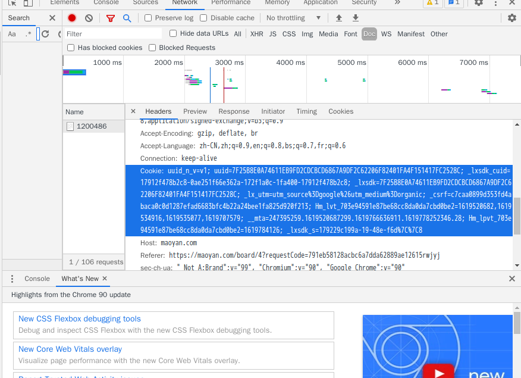

### 爬虫爬取猫眼电影TOP100


#### 流程

1. 填 header.Cookie
    * 它每隔一段时间就会有反爬虫来骚扰，因此我们在程序异常退出的情况下重新填写Cookie,
    不知道有没有更好的方案直接设置Cookie，手动难度太大。（有时候你刷新了网页也最好去
    将验证做一次。）
   * 

2. 提取具体数据
   * 这个需要对 `BeautifulSoup` 和`html` 有所了解：`tag.fin_all()`,`tag.find()` ......
   * [beautifulsoup 中文手册](https://beautifulsoup.readthedocs.io/zh_CN/v4.4.0/)
   * 爬取可能会中断(很可能是80),需要再进行Cookie重置

3. 请求链接图片
    * `requset.get(img_url)`

4. 数据整理到 `xxx.csv`
    * 使用`pandas`做,我们就填填列表就好


#### 运行
```bash
python -u ./spider.py
```

爬取成功的资源会在`/source`下面,记得必须设置`Cookie`,不过即使设置了也可能受到反爬虫的攻击!
